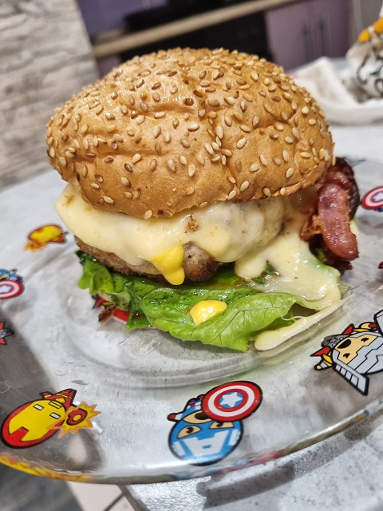

# Иструкция для работы с Markdown

![лого фото][def]

## Выделение текста

Для выделения курсивом нужны (*) или знаком нижнего подчеркивания (_) _пример_, пример *пример*

Для выделения полужирным нужно (**) или двойным (__), пример **пример**

Альтернативные способы выделения жирным или курсивом нужно для совмещения _текст может быть **разным**_.
## Списки

чтобы выделить не нумерованный список используйте (+)

для добавления списка необходимо в начале указать (*) Пример:
* элемент
* элемент
+ элемент 3

Для добавления нумерованного списка, указываем номер:
1. элемент
2. элемент

## Работа с изображениями

чтобы вставить изображение нужно:

## Ссылки

Подразумевается, что помимо URL-адреса существует еще текст ссылки. Он заключается в квадратные скобки. Для создания внутритекстовой гиперссылки необходимо использовать круглые скобки сразу после закрывающей квадратной
[пример MAIL](http://mail.ru/ "Необязательная подсказка")

## работа с таблицами
        
Снова поменяли!!!!!!
что?        

## Цитаты

## Заключение

[def]: 1234.jpg